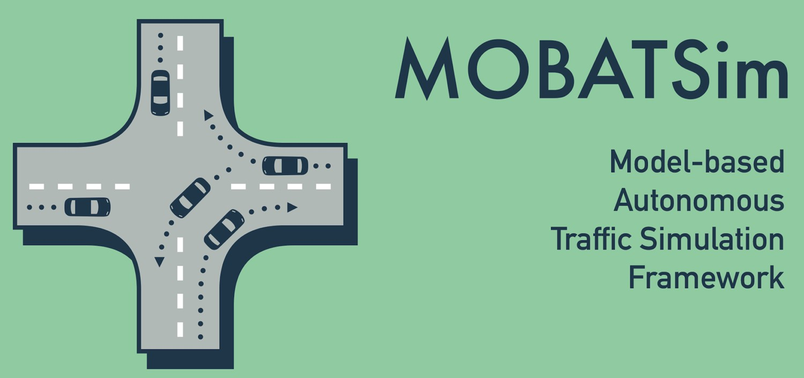
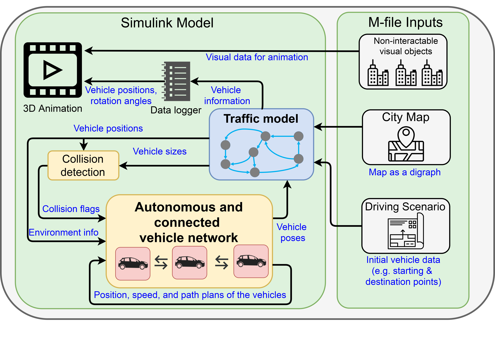

# **MOBATSim**

[](https://www.mathworks.com/matlabcentral/fileexchange/78444-mobatsim_opensource)
[](https://github.com/MOBATSim/MOBATSim/releases/tag/v1.0.2)
[](https://github.com/MOBATSim/MOBATSim/releases/tag/v1.0.2)
[](https://www.sciencedirect.com/science/article/pii/S2405896319304100)

MOBATSim (Model-based Autonomous Traffic Simulation Framework) is a simulation framework based on MATLAB Simulink that allows the user to assess vehicle level and traffic level safety by a 3D traffic simulation.



Automated driving systems tend to be more important and sophisticated in the nearest future. The functional safety assessment for these systems becomes an urgent necessity for the transition to full autonomy. Testing these functions consisting of decision and control algorithms with a lot of variables and parameters in a unified manner is a daunting task. Threat assessment has to be made for vehicles to actively avoid hazardous situations. This requires the analysis of complex operational profiles such as routing, intersection management and collision prediction in an environment where multiple vehicles are in different positions, and traveling at different speeds. There is a need for a comprehensive traffic simulation framework which models not only the functionality of the vehicles but also the interactions between them.

More detailed information about the scientific papers related to MOBATSim can be found on the [website](https://mobatsim.com/)

or you can visit our YouTube Channel where we publish the latest updates with tutorial videos:
[](https://www.youtube.com/c/MOBATSim)

## **Requirements**

#### MATLAB version requirement

MOBATSim is continuously updated with the newest version of MATLAB®. Therefore, at this moment, the requirement is MATLAB R2021a or MATLAB R2020b.

#### Toolbox Requirements

* Simulink® and Stateflow®
* Automated Driving Toolbox™
* Robotics System Toolbox™
* Control System Toolbox™
* Model Predictive Control Toolbox™  (only if MPC-Cruise Controller Block is used)
* Simulink 3D Animation Toolbox™ (Only required for the 3D Animation Virtual World)

## Workflow

MOBATSim has a project file which includes the Simulink files and their paths. As you run `MOBATSim.prj`, a GUI will open and you can run simulations from that GUI. The live script is a more detailed documentation than this one.

```
uiopen('\MOBATSim.prj',1)
```
To get to know the whole workflow in MOBATSim, take a look at the documentation and tutorials on our [website](https://mobatsim.com/). They explain how to run a simulation (including map generation, initializing vehicles and loading a driving szenario) and how to edit/ analyse the simulation.

## Simulation Framework

An overview of the simulation framework is shown in the figure below. For more details on the models, please refer to our [documentation](https://mobatsim.com/about-mobatsim/) on our website.



## Authors and Contact

Main Author: Mustafa Saraoglu

Message us via the [contact form](https://mobatsim.com/contact/) on our website

## Copyright Notice

© 2017 MOBATSim.

### Please Cite Our Related Paper as:

Saraoglu, M., Morozov, A., & Janschek, K. (2019). MOBATSim: MOdel-Based Autonomous Traffic Simulation Framework for Fault-Error-Failure Chain Analysis. IFAC-PapersOnLine, 52(8), 239–244. Elsevier BV. Retrieved from https://doi.org/10.1016%2Fj.ifacol.2019.08.077

BibTex:
```
@article{MOBATSim,
                title = {{MOBATSim}: {MOdel}-Based Autonomous Traffic Simulation Framework for Fault-Error-Failure Chain Analysis},
                journal = "IFAC-PapersOnLine",
                volume = "52",
                number = "8",
                pages = "239 - 244",
                year = "2019",
                note = "10th IFAC Symposium on Intelligent Autonomous Vehicles IAV 2019",
                issn = "2405-8963",
                doi = "https://doi.org/10.1016/j.ifacol.2019.08.077",
                url = "http://www.sciencedirect.com/science/article/pii/S2405896319304100",
                author = "Mustafa Saraoglu and Andrey Morozov and Klaus Janschek",
                keywords = "Autonomous driving, Fault injection, Error propagation, Safety analysis, Traffic simulator",
                }
```

## Contributing to MOBATSim

If you find MOBATSim useful and you would like to improve it by implementing your own automated driving algorithms you can simply "Fork" the repository, then switch to the development branch and make your changes there. Make sure your contributions fit the format in terms of coding or input/output properties of the Simulink blocks. To make sure that your changes work, you should run the "MOBATSimAutoTesting.m" and if you get "passed" from all the tests, you can simply send a "Pull Request" to the corresponding branch on the MOBATSim/MOBATSim repository. We would like to encourage everyone who would like to contribute so you can also contact us for a more detailed explanation of the structure!
